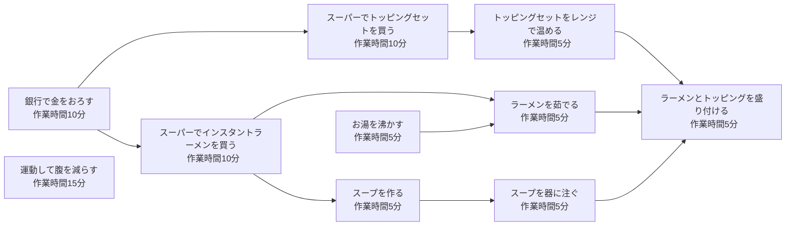

```mermaid

flowchart LR
  bank["銀行で金をおろす
  作業時間10分"]
  buy_ramen["スーパーでインスタントラーメンを買う
  作業時間10分"]
  buy_topping["スーパーでトッピングセットを買う
  作業時間10分"]
  hot["お湯を沸かす
  作業時間5分"]
  boil["ラーメンを茹でる
  作業時間5分"]
  topping["トッピングセットをレンジで温める
  作業時間5分"]
  soup["スープを作る
  作業時間5分"]
  pour_soup["スープを器に注ぐ
  作業時間5分"]
  arrangement["ラーメンとトッピングを盛り付ける
  作業時間5分"]
  play["運動して腹を減らす
  作業時間15分"]
  bank-->buy_ramen
  bank-->buy_topping
  buy_ramen-->boil
  hot-->boil
  buy_topping-->topping
  buy_ramen-->soup
  soup-->pour_soup
  topping-->arrangement
  boil-->arrangement
  pour_soup-->arrangement

```