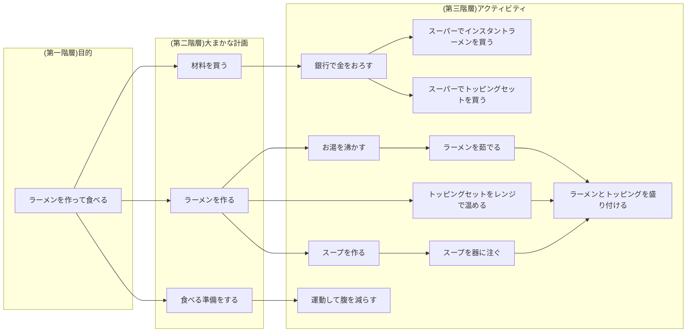

```mermaid

flowchart LR
subgraph "(第一階層)目的"
    eat_ramen["ラーメンを作って食べる"]
end
subgraph "(第二階層)大まかな計画"
    buy["材料を買う"]
    make["ラーメンを作る"]
    hungry["食べる準備をする"]
end
subgraph "(第三階層)アクティビティ"
    bank["銀行で金をおろす"]
    buy_ramen["スーパーでインスタントラーメンを買う"]
    buy_topping["スーパーでトッピングセットを買う"]
    hot["お湯を沸かす"]
    boil["ラーメンを茹でる"]
    topping["トッピングセットをレンジで温める"]
    play["運動して腹を減らす"]
    soup["スープを作る"]
    pour_soup["スープを器に注ぐ"]
    arrangement["ラーメンとトッピングを盛り付ける"]
end
eat_ramen-->buy
eat_ramen-->make
eat_ramen-->hungry
buy-->bank
bank-->buy_ramen
bank-->buy_topping
make-->hot
make-->topping
make-->soup
soup-->pour_soup
hot-->boil
boil-->arrangement
topping-->arrangement
pour_soup-->arrangement
hungry-->play
```