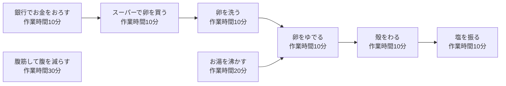

```mermaid

flowchart LR
  bank["銀行でお金をおろす
  作業時間10分"]
  super["スーパーで卵を買う
  作業時間10分"]
  wash_egg["卵を洗う
  作業時間10分"];
  hotwater["お湯を沸かす
  作業時間20分"]
  boil_egg["卵をゆでる
  作業時間10分"]
  crack["殻をわる
  作業時間10分"]
  salt["塩を振る
  作業時間10分"]
  exercise["腹筋して腹を減らす
  作業時間30分"]
  bank-->super
  super-->wash_egg
  wash_egg-->boil_egg
  hotwater-->boil_egg
  boil_egg-->crack
  crack-->salt

```