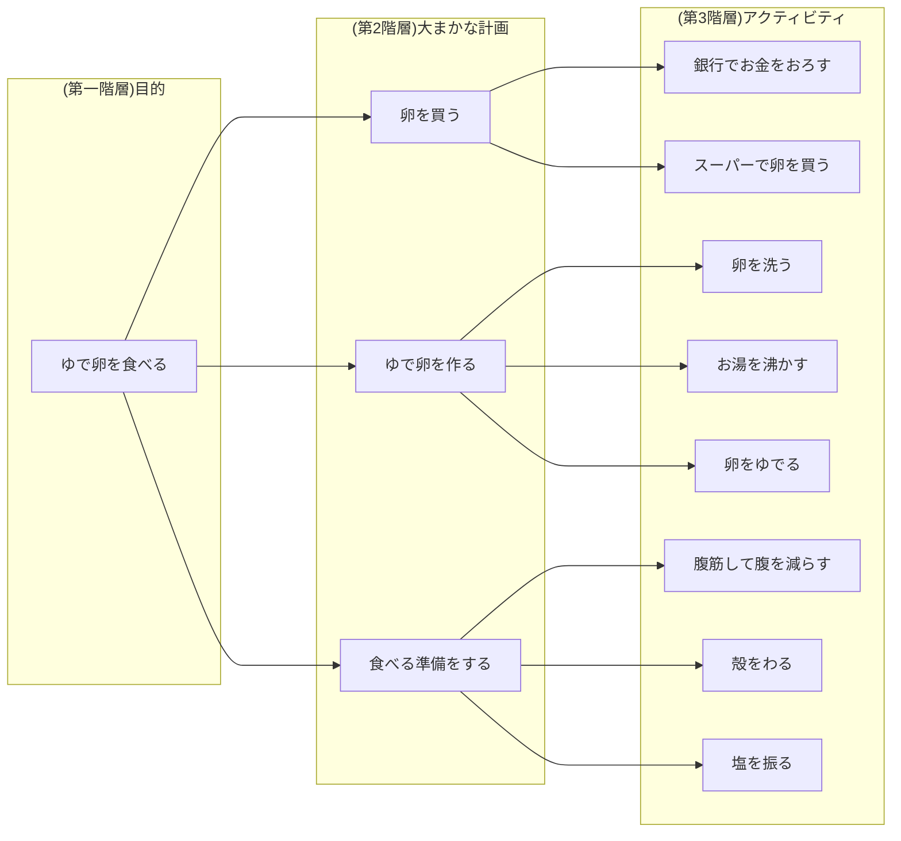

```mermaid

flowchart LR
subgraph "(第一階層)目的"
    eat_egg["ゆで卵を食べる"]
end
subgraph "(第2階層)大まかな計画"
    buy_egg["卵を買う"]
    cook_egg["ゆで卵を作る"]
    prepare_eat["食べる準備をする"]
end
subgraph "(第3階層)アクティビティ"
    bank["銀行でお金をおろす"]
    super["スーパーで卵を買う"]
    wash_egg["卵を洗う"];
    hotwater["お湯を沸かす"]
    boil_egg["卵をゆでる"]
    exercise["腹筋して腹を減らす"]
    crack["殻をわる"]
    salt["塩を振る"]
end
eat_egg--->buy_egg;
eat_egg--->cook_egg;
eat_egg--->prepare_eat;
buy_egg--->bank;
buy_egg--->super;
cook_egg--->wash_egg;
cook_egg--->hotwater;
cook_egg--->boil_egg;
prepare_eat--->exercise;
prepare_eat--->crack;
prepare_eat--->salt;

```